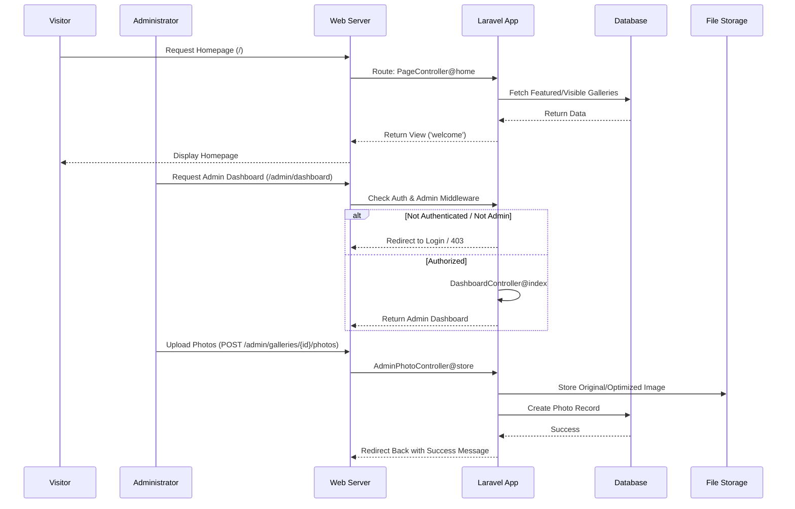

# Deployment Guide

This guide provides step-by-step instructions to deploy the Laravel project to a production environment.

## Prerequisites

Ensure your server meets the following requirements:

*   **OS:** Linux (Ubuntu 22.04 LTS or similar recommended)
*   **Web Server:** Nginx (recommended) or Apache
*   **PHP:** Version 8.2 or higher
*   **Database:** MariaDB (10.6+) or MySQL (8.0+)
*   **Composer:** For managing PHP dependencies
*   **Node.js & NPM:** (Latest LTS recommended) for building frontend assets

## Step-by-Step Deployment

### 1. Server Setup

Install the necessary software (example for Ubuntu/Nginx):

```bash
sudo apt update
sudo apt install nginx mariadb-server php8.2 php8.2-fpm php8.2-mysql php8.2-mbstring php8.2-xml php8.2-bcmath php8.2-curl php8.2-zip php8.2-intl php8.2-gd
sudo apt install composer npm
```

### 2. Clone the Repository

Navigate to your web root and clone the project:

```bash
cd /var/www
git clone https://github.com/your-username/your-repo.git project-name
cd project-name
```

### 3. Install Dependencies

Install PHP and Node.js dependencies:

```bash
# Install PHP dependencies (optimized for production)
composer install --optimize-autoloader --no-dev

# Install Node.js dependencies
npm install
```

### 4. Environment Configuration

Copy the example environment file and configure it:

```bash
cp .env.example .env
nano .env
```

Update the following keys in `.env`:

```ini
APP_ENV=production
APP_DEBUG=false
APP_URL=https://your-domain.com

DB_CONNECTION=mariadb
DB_HOST=127.0.0.1
DB_PORT=3306
DB_DATABASE=your_database_name
DB_USERNAME=your_database_user
DB_PASSWORD=your_database_password
```

### 5. Generate Application Key

```bash
php artisan key:generate
```

### 6. Database Setup

Create the database and run migrations:

```bash
# Log in to MySQL/MariaDB
sudo mysql -u root -p

# Run inside SQL prompt:
# CREATE DATABASE your_database_name;
# CREATE USER 'your_database_user'@'localhost' IDENTIFIED BY 'your_database_password';
# GRANT ALL PRIVILEGES ON your_database_name.* TO 'your_database_user'@'localhost';
# FLUSH PRIVILEGES;
# EXIT;

# Run migrations
php artisan migrate --force
```

### 7. Build Frontend Assets

Compile the CSS and JavaScript assets for production:

```bash
npm run build
```

### 8. Directory Permissions

Ensure the web server has write access to necessary directories:

```bash
sudo chown -R www-data:www-data storage bootstrap/cache
sudo chmod -R 775 storage bootstrap/cache
```

### 9. Web Server Configuration (Nginx)

Create a new configuration file: `/etc/nginx/sites-available/your-domain.com`

```nginx
server {
    listen 80;
    server_name your-domain.com;
    root /var/www/project-name/public;

    add_header X-Frame-Options "SAMEORIGIN";
    add_header X-Content-Type-Options "nosniff";

    index index.php;

    charset utf-8;

    location / {
        try_files $uri $uri/ /index.php?$query_string;
    }

    location = /favicon.ico { access_log off; log_not_found off; }
    location = /robots.txt  { access_log off; log_not_found off; }

    error_page 404 /index.php;

    location ~ \.php$ {
        fastcgi_pass unix:/var/run/php/php8.2-fpm.sock;
        fastcgi_param SCRIPT_FILENAME $realpath_root$fastcgi_script_name;
        include fastcgi_params;
    }

    location ~ /\.(?!well-known).* {
        deny all;
    }
}
```

Enable the site and restart Nginx:

```bash
sudo ln -s /etc/nginx/sites-available/your-domain.com /etc/nginx/sites-enabled/
sudo systemctl restart nginx
```

### 10. Final Optimization

Cache configuration and routes for better performance:

```bash
php artisan config:cache
php artisan event:cache
php artisan route:cache
php artisan view:cache
```

---

## Diagrams

### Application Structure

```mermaid
graph TD
    subgraph Frontend
        Blade[Blade Templates]
        Alpine[Alpine.js]
        Tailwind[Tailwind CSS]
        PublicAssets[Public Assets \(Images, JS, CSS\)]
    end

    subgraph Backend
        Routes[Routes \(web.php\)]
        Controllers[Controllers]
        Models[Eloquent Models]
        Middleware[Middleware \(Auth, Admin\)]
    end

    subgraph Database
        Users[Users Table]
        Galleries[Galleries Table]
        Photos[Photos Table]
        Posts[Posts Table]
        EventLogs[EventLogs Table]
    end

    subgraph Storage
        LocalDisk[Local Storage \(public/photos\)]
    end

    Blade --> Routes
    Routes --> Middleware
    Middleware --> Controllers
    Controllers --> Models
    Models <--> Database
    Controllers --> Blade
    Controllers --> LocalDisk
```

### Request Flow


